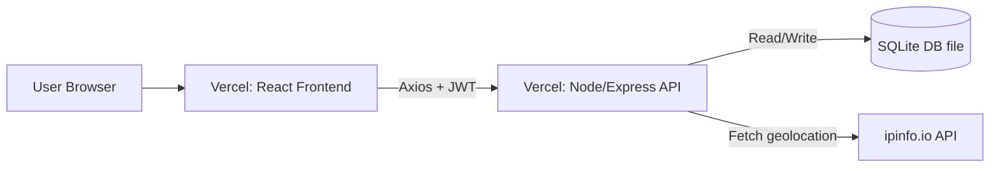

# Fullstack IP Geolocation App

Node.js 22+ is required (API uses built-in `node:sqlite`).

This workspace contains:

- `api` — Express + SQLite REST API
- `web` — React (Vite) frontend

## Run from Root Directory

Use the root folder as your working directory for all common commands:

1. Install root toolchain:
	```bash
	npm install
	```
2. Install backend and frontend dependencies:
	```bash
	npm run install:all
	```
3. Seed the API test user:
	```bash
	npm run seed
	```
4. Start both apps together (API + Web):
	```bash
	npm run dev
	```

Extra root commands:

- `npm run dev:api` (backend only)
- `npm run dev:web` (frontend only)
- `npm run build:web` (frontend production build)

Use each folder's README for setup and deployment:

- [API README](./api/README.md)
- [Web README](./web/README.md)

## Architecture Notes (Tradeoffs)

- **Monorepo-like workspace (`api` + `web`)**: chosen for faster local development and simpler exam submission; backend and frontend can still be deployed independently on Vercel.
- **Express REST API + JWT auth**: lightweight and easy to reason about for internship review; JWT allows stateless auth and clean protected-route middleware.
- **SQLite via built-in `node:sqlite`**: avoids external DB provisioning during development and keeps setup minimal; good for exam speed and reproducibility.
- **Search history persisted server-side**: ensures history is user-specific and available across sessions/devices, not tied only to browser storage.
- **React Context for auth state**: sufficient for app scope without adding Redux/Zustand complexity; token persistence is handled by `localStorage` + bootstrap check on app load.
- **IP geolocation via ipinfo.io**: fast integration and broad geo fields; app supports optional token through env var for rate-limit flexibility.

## API Contract Examples

Base URL (local): `http://localhost:8000`

### 1) Login

`POST /api/login`

Request:

```json
{
	"email": "user@example.com",
	"password": "password123"
}
```

Success (`200`):

```json
{
	"token": "<jwt>",
	"user": {
		"id": 1,
		"name": "Required User",
		"email": "user@example.com"
	}
}
```

Failure (`401`):

```json
{
	"message": "Invalid credentials"
}
```

### 2) Current User

`GET /api/me` (requires `Authorization: Bearer <jwt>`)

Success (`200`):

```json
{
	"id": 1,
	"name": "Required User",
	"email": "user@example.com",
	"created_at": "2026-02-27 00:00:00"
}
```

### 3) Create Search History

`POST /api/history` (requires token)

Request:

```json
{
	"ip_address": "8.8.8.8",
	"geo_data": {
		"ip": "8.8.8.8",
		"city": "Mountain View",
		"region": "California",
		"country": "US",
		"loc": "37.4056,-122.0775",
		"org": "AS15169 Google LLC",
		"timezone": "America/Los_Angeles"
	}
}
```

Success (`201`):

```json
{
	"id": 12,
	"ip_address": "8.8.8.8",
	"geo_data": {
		"ip": "8.8.8.8",
		"city": "Mountain View",
		"region": "California",
		"country": "US",
		"loc": "37.4056,-122.0775",
		"org": "AS15169 Google LLC",
		"timezone": "America/Los_Angeles"
	},
	"searched_at": "2026-02-27 00:10:00"
}
```

### 4) List and Delete History

`GET /api/history` (requires token)

Success (`200`):

```json
[
	{
		"id": 12,
		"ip_address": "8.8.8.8",
		"geo_data": { "ip": "8.8.8.8" },
		"searched_at": "2026-02-27 00:10:00"
	}
]
```

`DELETE /api/history` (requires token)

Request:

```json
{
	"ids": [12, 13, 14]
}
```

Success (`200`):

```json
{
	"deleted": 3
}
```

## Deployment Diagram


